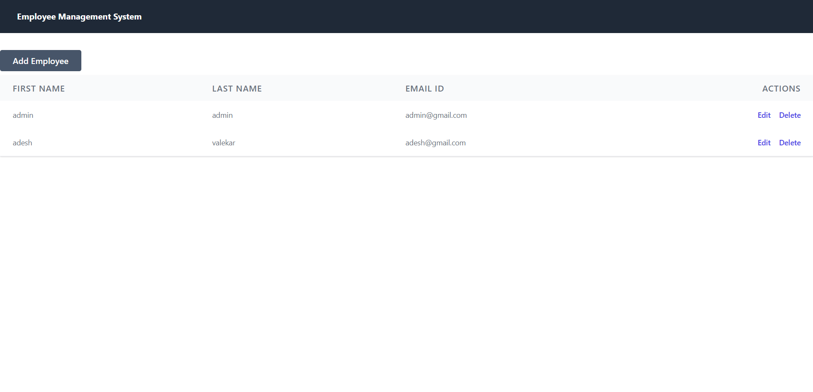
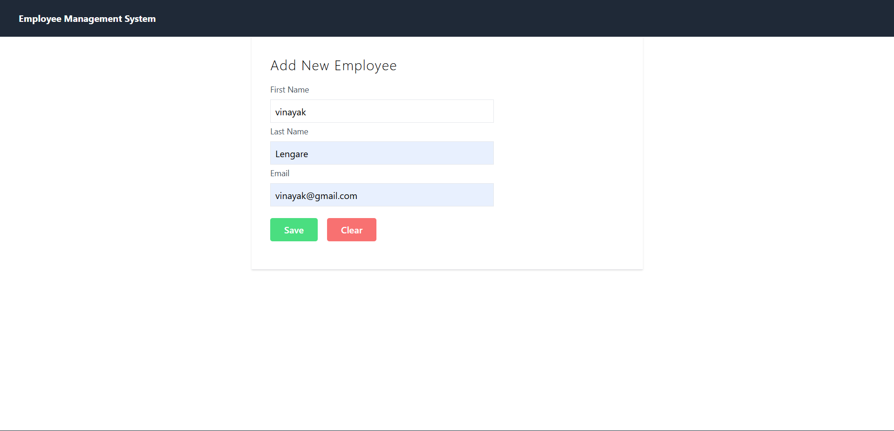
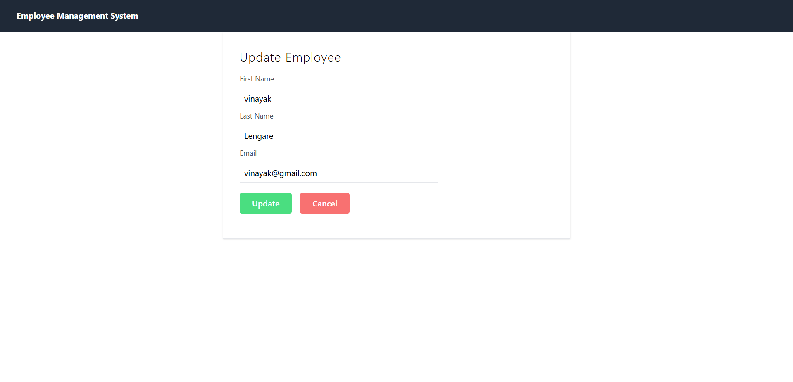

# Employee Management System

## Table of Contents

- [Project Overview](#project-overview)
- [Business Problem](#business-problem)
- [Technologies Used](#technologies-used)
- [Project Structure](#project-structure)
- [Key Features](#key-features)
- [Research Questions and Key Findings](#research-questions-and-key-findings)
- [Screenshots](#screenshots)
- [How to Run the Project](#how-to-run-the-project)
- [Customization](#customization)

## Project Overview

The Employee Management System is a full-stack web application built with Spring Boot and React. This application provides a comprehensive solution for managing employee information, allowing users to perform CRUD (Create, Read, Update, Delete) operations on employee records. The system features a modern, responsive frontend built with React and a robust backend powered by Spring Boot with MySQL database integration.

The application enables organizations to efficiently manage their employee data through an intuitive user interface, with features for adding new employees, viewing employee lists, updating employee information, and removing employees from the system.

## Business Problem

Many small to medium-sized organizations struggle with managing employee data using traditional methods such as spreadsheets or paper records. These approaches are prone to errors, difficult to maintain, and lack real-time accessibility. The Employee Management System addresses these challenges by providing:

- Centralized storage of employee information
- Easy access and retrieval of employee data
- Efficient management of employee records
- Reduced manual work and potential for human error
- Improved data integrity and consistency
- Scalable solution for growing organizations

## Technologies Used

### Backend:
- **Spring Boot 3.2.0**: Framework for building the RESTful API
- **Java 17**: Programming language for backend development
- **Spring Data JPA**: For database interactions
- **MySQL 8.0**: Relational database for storing employee data
- **Hibernate**: ORM framework for database operations
- **Maven**: Dependency management

### Frontend:
- **React 18.1.0**: JavaScript library for building user interfaces
- **React Router DOM**: For client-side routing
- **Axios**: HTTP client for API requests
- **Create React App**: Development environment and build tools

### Development Tools:
- **Eclipse IDE**: Integrated Development Environment
- **Git**: Version control system

## Project Structure

```
EMSystem (Backend)
├── src
│   ├── main
│   │   ├── java/com/ems
│   │   │   ├── controller
│   │   │   │   └── EmployeeController.java
│   │   │   ├── entity
│   │   │   │   └── EmployeeEntity.java
│   │   │   ├── model
│   │   │   │   └── Employee.java
│   │   │   ├── repository
│   │   │   │   └── EmployeeRepository.java
│   │   │   ├── service
│   │   │   │   ├── impl
│   │   │   │   │   └── EmployeeServiceImpl.java
│   │   │   │   └── EmployeeService.java
│   │   │   └── EmSystemApplication.java
│   │   └── resources
│   │       └── application.properties
├── pom.xml

employee-management-system-ui (Frontend)
├── public
├── src
│   ├── components
│   │   ├── AddEmployee.js
│   │   ├── Employee.js
│   │   ├── EmployeeList.js
│   │   ├── Navbar.js
│   │   └── UpdateEmployee.js
│   ├── services
│   │   └── EmployeeService.js
│   ├── App.js
│   └── index.js
├── package.json
└── README.md
```

## Key Features

### Backend Features:
- **RESTful API**: Clean and well-structured API endpoints for all CRUD operations
- **JPA Integration**: Object-relational mapping for efficient database operations
- **Spring Security**: (Can be extended) for authentication and authorization
- **Data Validation**: Input validation and error handling
- **CORS Configuration**: Cross-origin resource sharing enabled for frontend integration

### Frontend Features:
- **Responsive Design**: Mobile-friendly interface using Tailwind CSS
- **Employee Management**: Create, read, update, and delete employee records
- **Dynamic Routing**: React Router for seamless navigation
- **Form Validation**: Input validation on the client side
- **Real-time Updates**: Immediate reflection of changes without page refresh
- **Intuitive UI**: Clean and user-friendly interface

### API Endpoints:
- `POST /api/v1/employees` - Create a new employee
- `GET /api/v1/employees` - Retrieve all employees
- `GET /api/v1/employees/{id}` - Retrieve a specific employee
- `PUT /api/v1/employees/{id}` - Update an employee
- `DELETE /api/v1/employees/{id}` - Delete an employee

## Research Questions and Key Findings

### Research Questions:
1. How can a full-stack application be structured to maintain separation of concerns?
2. What is the most efficient way to handle CRUD operations in a Spring Boot-React application?
3. How can data consistency be maintained between the frontend and backend?
4. What technologies provide the best performance and user experience for this type of application?

### Key Findings:
- **Separation of Concerns**: Using Spring Boot for the backend API and React for the frontend provides clear separation while maintaining efficient communication
- **State Management**: React's component-based architecture effectively manages UI state and provides a seamless user experience
- **Database Integration**: Spring Data JPA simplifies database operations and reduces boilerplate code
- **Performance**: The combination of Spring Boot and React provides excellent performance for typical CRUD operations
- **Scalability**: The architecture is designed to scale with increasing data and user load

## Screenshots







## How to Run the Project

### Prerequisites:
- Java 17 or higher
- Node.js (v14 or higher) and npm
- MySQL 8.0 or higher
- Maven

### Backend Setup:
1. Navigate to the `EMSystem` directory: `cd EMSystem`
2. Configure the database in `src/main/resources/application.properties`:
   ```properties
   spring.datasource.url=jdbc:mysql://localhost:3306/employee_system?useSSL=false&serverTimezone=UTC&allowPublicKeyRetrieval=true
   spring.datasource.username=your_mysql_username
   spring.datasource.password=your_mysql_password
   ```
3. Create a MySQL database named `employee_system`
4. Run the application using Maven: `mvn spring-boot:run`
5. The backend server will start on `http://localhost:8080`

### Frontend Setup:
1. Navigate to the `employee-management-system-ui` directory: `cd employee-management-system-ui`
2. Install dependencies: `npm install`
3. Start the development server: `npm start`
4. The frontend will be accessible at `http://localhost:3000`

### Running Both:
1. Start the backend server first (port 8080)
2. Then start the frontend server (port 3000)
3. Access the application at `http://localhost:3000`

### Database Configuration:
- Create a database named `employee_system` in MySQL
- The application will automatically create the `employees` table based on the Entity class
- Default database credentials in the application.properties file can be changed as needed

## Customization

### Backend Customization:
- **Database**: Modify `application.properties` to connect to your preferred database
- **API Endpoints**: Modify `EmployeeController` to add new endpoints or change existing ones
- **Entity Model**: Extend `EmployeeEntity` to add more fields to the employee model
- **Validation**: Add validation annotations to the Employee model
- **Security**: Implement Spring Security for authentication and authorization

### Frontend Customization:
- **Styling**: Modify CSS classes to change the appearance
- **Components**: Extend existing components or create new ones for additional functionality
- **Routing**: Add new routes in `App.js` for additional pages
- **API Service**: Modify `EmployeeService.js` to handle additional API endpoints
- **Form Validation**: Add more sophisticated validation in the form components

### Adding New Features:
- **Search Functionality**: Add search capabilities to filter employee lists
- **Pagination**: Implement pagination for large employee datasets
- **File Upload**: Add profile picture upload functionality
- **Reports**: Generate employee reports in PDF/Excel format
- **User Authentication**: Implement login/logout functionality
- **Role-based Access**: Add different user roles with specific permissions

### Environment Variables:
- Update the API base URL in `EmployeeService.js` if the backend runs on a different port
- Modify database connection settings in `application.properties` as per your environment

---

© 2025 Vedant Ligade. All rights reserved.
